#   **Project 3: Aldojo**

[Launch project on Heroku](https://aldojo.herokuapp.com/)

## Overview

Aldojo is a world food ranking app created by Alex(Al), Doris(Do) and Josh(Jo) that allows users to vote on and discover the best food in each country. Users can register and login, creating, editing and deleting food on particular country. Users can also review the country, food and vote for the food. On the profile page, user can see the record of the food and the country they have reviewed.

Aldojo was my third project of General Assembly's Web Development Immersive course. The objective was to build a full stack(MEAN) web application using AngularJS in **one week**.

## Brief
To design and build a MEAN stack app with our own design as part of a group.
The app must :

### Backend

* Use Mongo, Node & Express
* At least 2 related models, one of which should be a user
* Should include all RESTFUL actions for at least one of those models
* Include authentication to restrict access to appropriate users
* Include at least one referenced or embedded sub-document
* Include automated tests


### Frontend

* Use Angular to build a front-end that consumes your API
* Use SCSS instead of CSS
* Use Webpack & Yarn to manage dependencies and compile source code

## Technologies Used

- Angular
- JavaScript (ES6)
- HTML5
- SCSS
- Bulma CSS Framework
- Git
- GitHub
- Bcrypt
- JWT
- Moment.js
- Mongoose
- Heroku
- Trello
- Yarn
- Chai
- Mocha

### APIs Used
* [REST Countries](https://restcountries.eu/)

## Approach Taken
We began the initial planning stage by first trying to collectively decide on a project idea that interested all members of our team. We knew that we wanted to create an app centred on travel and food, and from there the idea of a national dish rankings was agreed.  Whith the idea agreed we began by planning our features and what models we would need and agreed on what to include in the MVP.

We started by building out the backend routes and testing them in Insomnia to ensure we had a solid backend. We worked on building basic RESTful routes for country, food and the user at the beginning. Then we moved to frontend, make sure it worked properly and we used external API to get basic country data for each of the countries.

### Trello
Using Trello, we broke down everything we could think of into smaller tasks - this allowed us to effectively delegate tasks and set up the basic app relatively quickly. We could keep track of who was doing what, what stage they were at and what was left to do.

This helped us work effectively and ensure that we weren't accidentally working on the same sections, helping to reduce merge conflicts.

## Screenshots

### Home Page


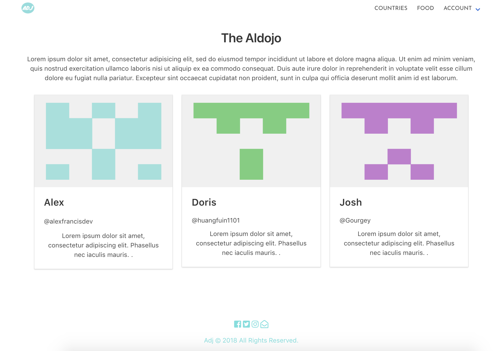


### Register

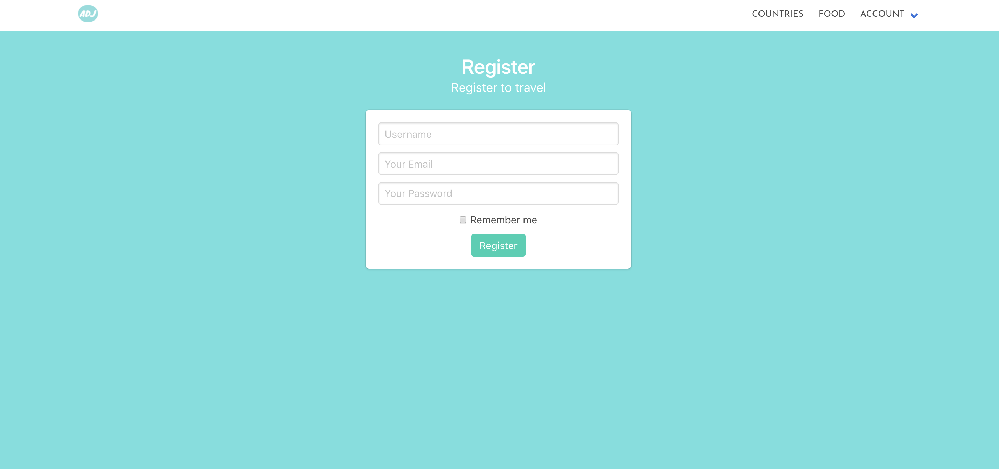


### Login

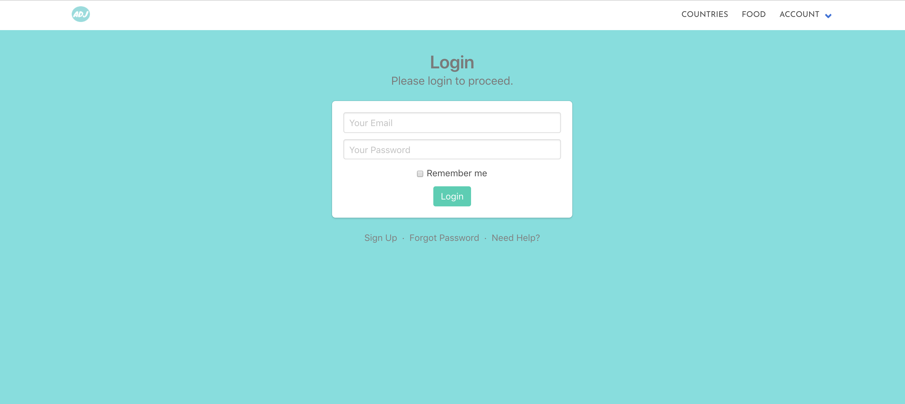


### Search a Country (Country Index)
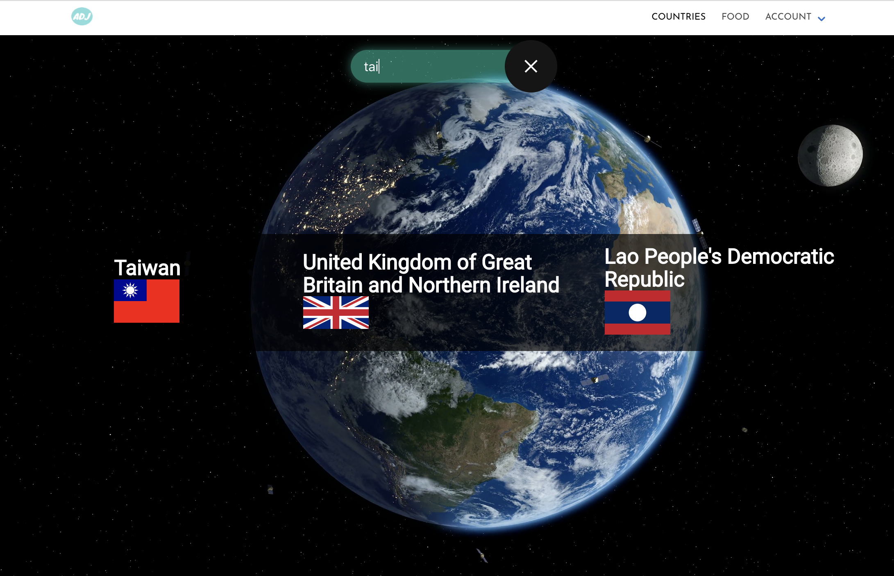

### Inside a Country (Country Show)
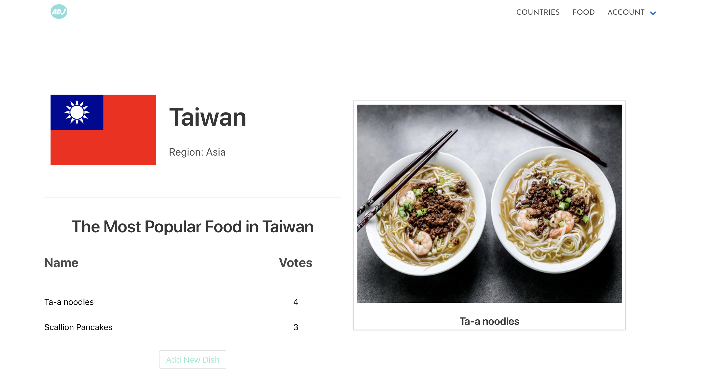

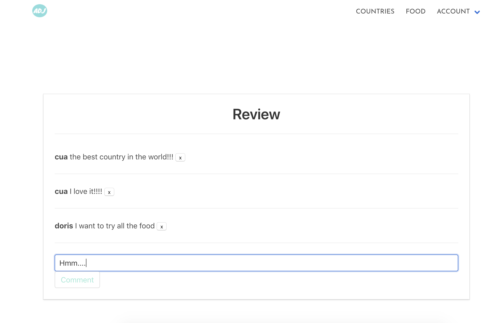

### Add a Country
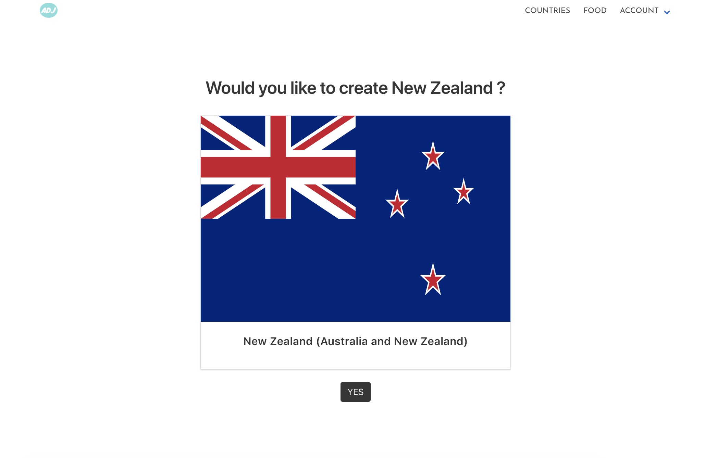

### Looking for Food (Food Index)


### Food Show Page
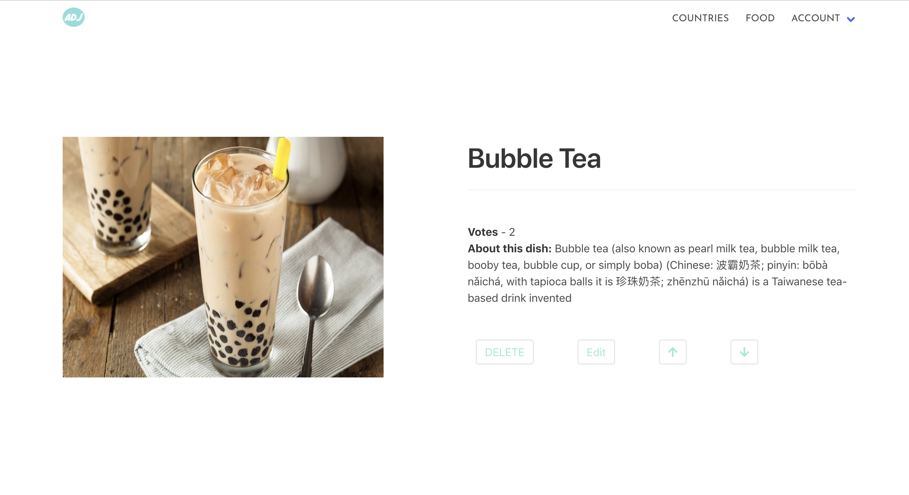

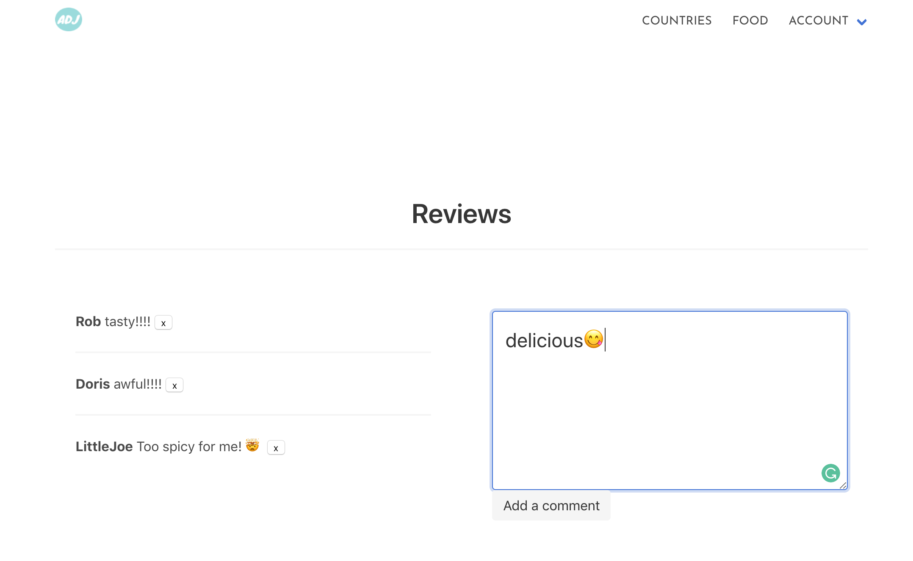


### Profile Page
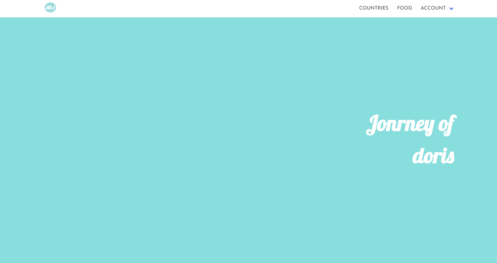

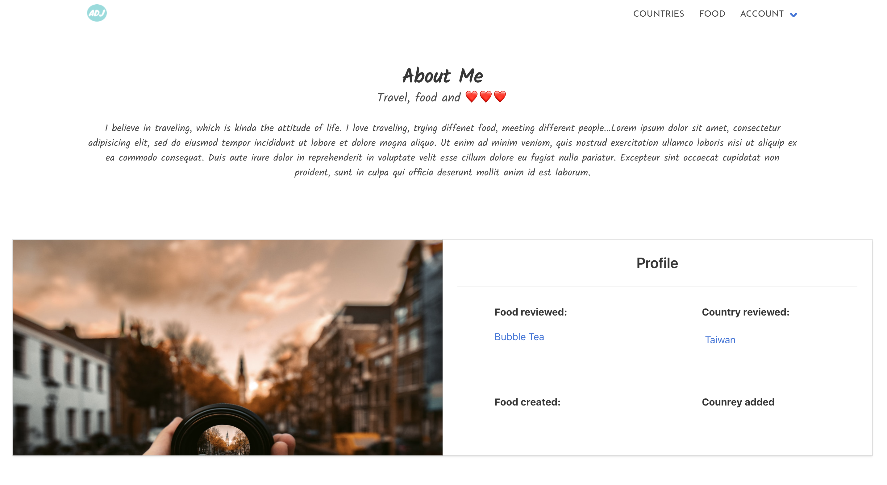


## Responsive Mode

### Home Page
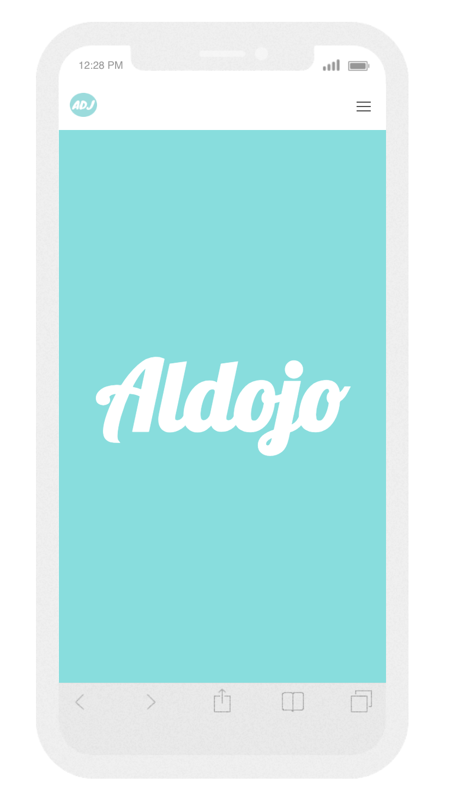

### Food Show Page
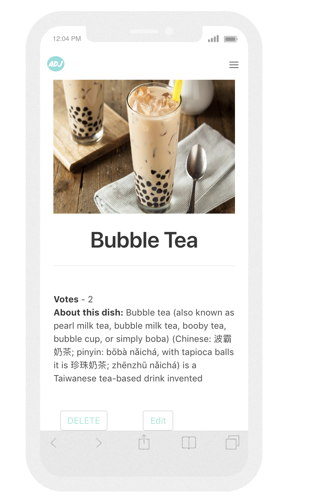

### Profile Page
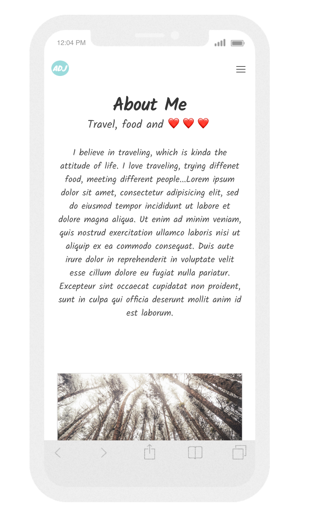

## Functionality

### Featured Piece of Code no.1
This is how we use external API to get all the country data, and use the country alpha3Code as the url of each individal country. When sending a request for a country, if the country it's in our database, will go stright to the country Show page, if not, will diresct to country New page to create a new page.
From src/controllers/countries/indexCtrl.js and src/controllers/countries/showCtrl.js
```
function indexCtrl($state, $scope, $http) {
  $http({
    method: 'GET',
    url: 'https://restcountries.eu/rest/v2/all',
    skipAuthorization: true
  }).then(result => {
    console.log(result);
    $scope.countries = result.data;
  });
  $scope.findCountry = function() {
    $http({
      method: 'GET',
      url: `https://restcountries.eu/rest/v2/name/${$scope.searchTerm}`,
      skipAuthorization: true
    }).then(result => {
      $scope.searchResults = result.data;
    });
  };
}


function showCtrl($state, $scope, $http, $location) {
  $http({
    method: 'GET',
    url: `/api/countries/alpha3/${$state.params.alpha3Code}`
  }).then(result => {
    if (result.data) {
      console.log(result.data, 'result datas');
      $scope.country = result.data;
    } else {
      $location.path(`/countries/new/${$state.params.alpha3Code}`).replace();
    }
  });
```
### Featured Piece of Code no.2
This is for vote/unvote a particular food. Each user can only vote once for the same food. It checked if the user has been voted for the particular food, then the vote of the food wouldn't increase. If the user has voted the food, the user can remove the vote.
From controllers/voteController.js

```
function vote(req, res, next) {
  Food
    .findById(req.params.foodId)
    .then(food => {
      if (!food.votes.find(userId => userId.toString() === req.tokenUserId)) {
        food.votes.push(req.tokenUserId);
        return food.save();
      } else {
        res.status(422).json({ message: 'Cannot vote twice'});
        next();
      }
    })
    .then(food => res.json(food))
    .catch(next);
}

function unvote(req, res, next) {
  Food
    .findById(req.params.foodId)
    .then(food => {
      if (!food.votes.find(userId => userId.toString() === req.tokenUserId)) {
        res.status(422).json({ message: 'No vote to remove'});
      } else {
        food.votes = food.votes.filter(x => x.toString() !== req.tokenUserId);
        return food.save();
      }
    })
    .then(food => res.json(food))
    .catch(next);
}
```
### Featured Piece of Code no.3
When user has reviewd a country/food for more than once, it will only appear once on the profile page by filtering the country/food index in the array.
From src/controllers/profileCtrl.js

```
function profileCtrl($scope, $http, $state) {
  $http({
    method: 'GET',
    url: `/api/users/${$state.params.id}`
  }).then(result => {
    console.log('the result is', result);
    $scope.commentAuthor = result.data;
    $scope.commentAuthor.countryComments = $scope.commentAuthor.countryComments.sort().filter((country, index, array) => {
      if(index === 0) return true;
      return array[index - 1].id !== country.id;
    });
    $scope.commentAuthor.foodComments = $scope.commentAuthor.foodComments.sort().filter((food, index, array) => {
      if(index === 0) return true;
      return array[index - 1].id !== food.id;
    });
  });
}
```

### Wins and Blockers

The big win for us as a team I would say is the teamwork. Every one has contributed each part of the app, from backend, front and the styling.

Our biggest challenge would be at the beginning that we couldn't get the countryShow route done for the confusion of the reference between country and food. The vote and upvote for the food is another challenge as we realised that token is an object instead of a string.
When we had basic RESTful routes done, it took us about 2 days to apply the external API.


### Future Features

There are some features planned to add on Aldojo, including:

* Show the country and food that user has created on user profile page.
* Show the food that user has voted on the user profile page.
* Write entire code test for backend routes.
* Apply external API (map) for the location of each country and the food.
* Create another route for user to manage their own profile.
* Improve responsive design.
* Increase more catalogues such as books and special events of the country.
